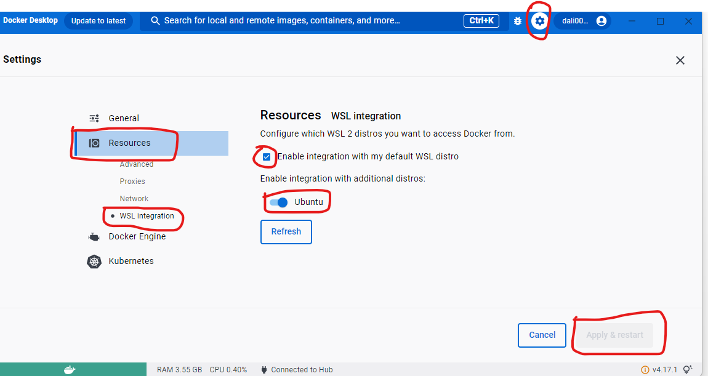

### Install With Sail(Docker)

wsl:
user: dali0023
pass: BR0455815

1. search `wsl` on windows and double it to run. it will run internally.
2. Open Docker `Desktop>settings>Resources>WSL Integration`:
   - Enable integration with my default WSL distro
   - Ubuntu



3. open `CMD Terminal` as `Run As Administor` mode, then type: `wsl --install -d Ubuntu`
4. go to: [Laravel Sail](https://laravel.com/docs/10.x/installation#choosing-your-sail-services)
5. Run on terminal: `curl -s "https://laravel.build/example-app?with=mysql,redis" | bash`
6. it will ask pass: BR0455815
7. ls
8. `cd `test and run terminal to open apps on VS Code: `code .`

10. `./vendor/bin/sail up` & then we will see our apps to Docker Desktop and aslo visit localhost.

visit: http://localhost

10. Adding PHPMyAdmin to Laravel Sail:
Go to Project `docker-compose.yml`:
```yml
    phpmyadmin:
        depends_on:
            - mysql
        image: phpmyadmin/phpmyadmin
        environment:
            - PMA_HOST=mysql
            - PMA_PORT=3306
        networks:
            - sail
        ports:
            - 8080:80
networks:
    sail:
        driver: bridge
```
11. go to: `http://localhost:8080/`
check user an password from project `.env file`
user name: sail
password: password

you will see all of your databases!

##### Testing:
run from sail in docker: `./vendor/bin/sail test`

##### Create Test:
```
./vendor/bin/sail artisan make:test UserTest
./vendor/bin/sail artisan make:test MyTest --unit
```

## Launch an instance AWS Linux Server:
* **Name and tags**: any name (ex: my-aws-server)
* **Application and OS Images (Amazon Machine Image):** Amazon Linux AWS
* **Instance type:** select default (any free tier eligible)
* **Key pair (login):** Create new key pair:
     * Key pair name (any name ex: aws-web-server-key)
     * Key pair type (RSA)
     * Private key file format: 
          * for use with OpenSSH select: .pem
          * for use with **Putty** select: **.ppk**
          * create and download key to use for putty
* **Network settings:** 
     * Select existing security group: Jenkins_Security_group (already created)
     * OR Create Security Group: 
        * Network Settings: edit:
        * Create Security group
        * Security Group name- any name 
        * Security Group desc- any desc. 
        * And add new rule: port range- 8080, source: 0.0.0.0/0, ::0
* **Launch Instance**

## Install MobaXterm or Putty to connect Amazon Linux Server to local machine.
* **For Putty:**
   * Copy Public IPv4 address(ex: 35.182.74.38) from Amazon EC2 Server.
   * Host Name: IPv4 address and Default port: 22 
   * In the Category pane, expand ```Connection```, expand ```SSH```, and then select ```Auth```. Complete the following:
       * select Private key file for Authentication
           * Select the **.ppk file (aws-web-server-key)** that you generated for your key pair.
       * then Open
       * Login as: ec2-user

* **For MobaXterm:**
   * Copy Public IPv4 address(ex: 35.182.74.38) from Amazon EC2 Server
   * MobaXterm>Session>SSH>
   * Remote Host- 35.182.74.38>Select Specify Username- any name(ex: ec2-user)
   * Advanced SSh Settings: select Use Private key- upload Key pair file that we download when create EC2 Server.
   * Ok
   * New linux terminal will open, to go root dir> run: sudo su –
   * Pwd to check

## Docker Install on Amazon Linux
* **Install Docker**
```sh
sudo yum update -y
sudo yum -y install docker
```
* **Start Docker**
```sh 
sudo service docker start
```
* **Access Docker commands in ec2-user user**
```sh
sudo usermod -a -G docker ec2-user
sudo chmod 666 /var/run/docker.sock
docker version
```

Make docker auto-start

`sudo chkconfig docker on`

Because you always need it....

`sudo yum install -y git`

Reboot to verify it all loads fine on its own.

`sudo reboot`

## docker-compose install
```sh
sudo curl -L https://github.com/docker/compose/releases/latest/download/docker-compose-$(uname -s)-$(uname -m) -o /usr/local/bin/docker-compose
```
```sh
sudo chmod +x /usr/local/bin/docker-compose

ln -s /usr/local/bin/docker-compose /usr/bin/docker-compose

docker-compose version
```
## Downloading and installing Jenkins on AWS Linux 2023
```
sudo yum update –y

sudo wget -O /etc/yum.repos.d/jenkins.repo \
    https://pkg.jenkins.io/redhat-stable/jenkins.repo
    
sudo rpm --import https://pkg.jenkins.io/redhat-stable/jenkins.io-2023.key
sudo yum upgrade
sudo dnf install java-11-amazon-corretto -y
sudo yum install jenkins -y
sudo systemctl enable jenkins
sudo systemctl start jenkins
sudo systemctl status jenkins
```
#### Configuring Jenkins:
* Connect to **http://<Public IPv4 address from AWS>:8080** from your windows browser. ex: http://3.99.248.102:8080/
* you will see this page:
* 
* On Terminal: ```sudo cat /var/lib/jenkins/secrets/initialAdminPassword```
* you will get a password and paste it on the page
* Click **Install suggested plugins**.
* Once the installation is complete, the Create First Admin User will open. Enter your information, and then select Save and Continue.
  * username: admin
  * password: BR0455815
* On the left-hand side, select **Manage Jenkins**, and then select **Manage Plugins**.
* Select the **Available tab**, and then enter **Amazon EC2 plugin** at the top right.
* **Select the checkbox next to Amazon EC2 plugin**, and then select **Install without restart**.
* Once the installation is done, select **Back to Dashboard**.
* Select **Configure a cloud** if there are no existing nodes or clouds from **Dashboard**.
* 
* After navigating to **Manage Jenkins**, select **Configure Nodes and Clouds** 
* 
* From here, select Clouds.

* Select Add a new cloud, and select Amazon EC2. A collection of new fields appears.

* Click Add under Amazon EC2 Credentials:

* From the Jenkins Credentials Provider, select AWS Credentials as the Kind.

* Scroll down and enter in the IAM User programmatic access keys with permissions to launch EC2 instances and select Add.

* Scroll down to select your region using the drop-down, and select Add for the EC2 Key Pair’s Private Key.

 * Select region: **ca-central-1**
* From the Jenkins Credentials Provider, select SSH Username with private key as the Kind and set the Username to ec2-user.

* Scroll down and select Enter Directly under Private Key, then select Add.


* Open the private key pair you created in the creating a key pair step and paste here:

* Scroll down to "Test Connection" and ensure it states "Success". Select Save when done


