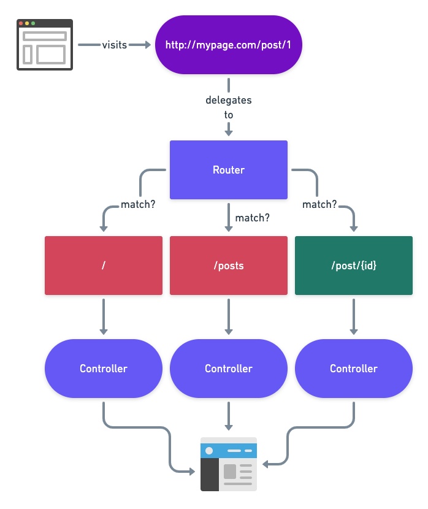
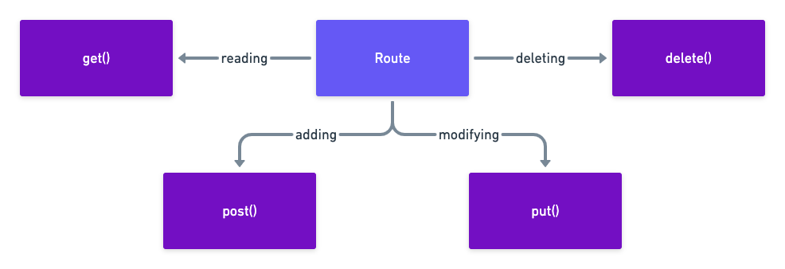

### How routing works (diagram)


### HTTP verb methods on Route class (diagram)


### Inside route definition file (routes/web.php)

Basic Routing:

```php
Route::get('/', function () {
    return view('welcome');
});

Route::get('/user', [UserController::class, 'index']);
Route::get('/user/{id}', [UserController::class, 'index']); // With Required Parameter
Route::get('/user/{id?}', [UserController::class, 'index']); // With Optional Parameter
Route::get('/posts/{post}/comments/{comment}', [UserController::class, 'index']);

Route::get('/user', [UserController::class, 'index'])->where('name', '[A-Za-z]+'); // with Regular Expression
Route::get('/user/{id}', [UserController::class, 'index'])->where('id', '[0-9]+');

Route::get('/user/profile', [UserController::class, 'show'])->name('profile'); // Named Route

// Route Groups
Route::controller(OrderController::class)->group(function () {
    Route::get('/orders/{id}', 'show');
    Route::post('/orders', 'store');
});

// php artisan route:list 
Route::redirect('/here', '/there'); // Redirect Routes:
```

### Inside Blade template
##### Building Layouts
 - Layouts Using Components
```blade
// layout.blade.php
<html>
    <head>
        <title>App Name - @yield('title')</title>
    </head>
    <body>
        <div>
            @yield('slide')            
            @yield('content')
        </div>
    </body>
</html>

// child.php
<x-layout>
    <x-slot:title>
        Home Title
    </x-slot>

     <x-slot:slide>
        display Slide
    </x-slot>

    // This is my body content
    @foreach ($tasks as $task)
        {{ $task }}
    @endforeach
</x-layout>
```

Rendering data inside a Blade template

```blade
{{ $data }} // Rendering data inside a Blade template

```

*By default data is escaped using `htmlspecialchars`*

Rendering unescaped data

```blade
{!! $data !!}
```

Including another view

```blade
@include('view.name')
```

*Included view will inherit parent view data*

Passing additional data to included view

```blade
@include('view.name', ['name' => 'John'])
```

Generating a URL inside view

```blade
<a href="{{ route('home') }}">Home</a>
```
