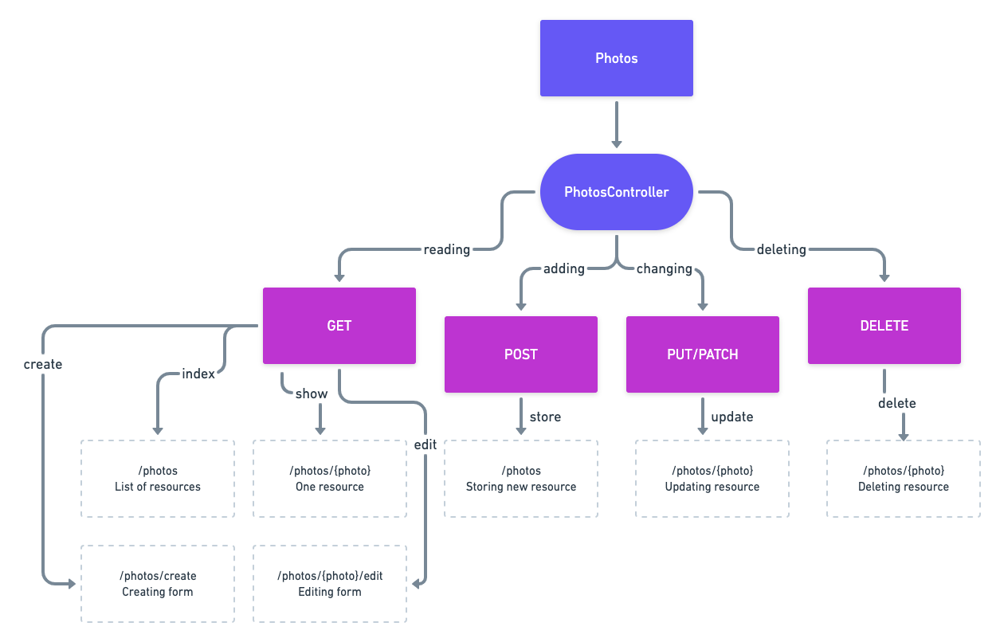

## Resource controllers

You can import the model class in your controller

```php
use App\BlogPost

// Now it can be used like this
BlogPost::all();
// Instead of 
\App\BlogPost::all();
```

### Resource controllers overview (diagram)



### Resource controllers

If you think about a single resource, like photo - resource controllers let you organize all controller logic around that resource easily

Using resource controllers

```php
Route::resource('posts', 'PostController');
```

Instead of manually specifying routes

```php
Route::get('/posts', 'PostController@index')->name('blog.index');
Route::get('/posts/{id}', 'PostController@show')->name('blog.show');
```

Generating a new resource controller with all the resource methods

`php artisan make:controller PostController --resource`

Resource methods table

|Verb		  | URI      |Action        |Route Name |
|--------   |--------  |--------      |--------   |
|GET	|/posts	      |index          |posts.index |
|GET	|/posts/create	|create	     | posts.create |
|POST	|/posts	|store	               |posts.store |
|GET	|/posts/{photo}	|show	        |posts.show |
|GET	|/posts/{photo}/edit	|edit	  |posts.edit |
|PUT/PATCH	|/posts/{photo}	|update |posts.update |
|DELETE	|/posts/{photo}	|destroy	  |posts.destroy |

To enable only certain routes

```php
Route::resource('posts', 'PostController')->only(['index', 'show']);
```

To disable specific routes

```php
Route::resource('posts', 'PostController')->except(['create', 'store', 'edit', 'update', 'destroy]);
```

*Both examples above will result in the same routes - posts.index and posts.show*

### Fetching a single model

Model can be fetched using `BlogPost::find($id)`

To display a 404 Not Found page when model cannot be found, use `BlogPost::findOrFail($id)`

### Route Model Binding

Those 2 examples are equivalent

```php
PostController extends Controller {
	public function show($post) {
		return view('post.show', ['post' => BlogPost::findOrFail($id)]);
	}
}
```
Above, we manually try to fetch the BlogPost model. `findOrFail` will show a 404 page if model is not found.

```php
PostController extends Controller {
	public function show(BlogPost $post) {
		return view('post.show', ['post' => $post]);
	}
}
```
Above we use **Route Model Binding**. If the method parameter name matches the route segment, eg. route is `/posts/{post}` the variable name has to be `$post`. Then `type hinting` (specyfying the argument type) as the Eloquent model `BlogPost`, tells Laravel to try and fetch this object by `id`.

To customize the property by which the model is fetched (using **Route Model Binding**!), add the `getRouteKeyName()` method to the model.

```php
public function getRouteKeyName()
{
    return 'slug';
}
```

With the example above, Laravel would try to find a `BlogPost` model by `slug` property.
