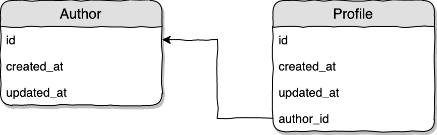

## One-to-One relations

## Database design



In the example above each `Author` model has one `Profile`.

## Defining relations
Create Model with Migration
`php artisan make:model Author -m`
`php artisan make:model Profile -m`

The relation on `Author` model:
```
class Author extends Model
{
    public function profile()
    {
        return $this->hasOne('App\Profile');
    }
}
```
Relation on `Profile` model:

```
class Profile extends Model
{
    public function author()
    {
        return $this->belongsTo('App\Author');
    }
}
```

## Migrations

`Author` model migration:
```
Schema::create('authors', function (Blueprint $table) {
    $table->bigIncrements('id');
    $table->timestamps();
});
```

`Profile` model migration:
```
Schema::create('profiles', function (Blueprint $table) {
    $table->bigIncrements('id');
    $table->timestamps();

    $table->unsignedBigInteger('author_id');
    $table->foreign('author_id')->references('id')->on('authors');
});
```        
#### Note
In Phone Table, if we make column according to model name the id `(ex: user_id)`, our relationship will work without problem. But if different name `(ex:user_no_id)`, we must mention it as `foreign_key`.
```
class User extends Model
{
    public function phone()
    {
        return $this->hasOne('App\Phone', ' user_no_id');
    }
}

class `Phone` extends Model
{
    public function user()
    {
        return $this->belongsTo('App\User','user_no_id');
    }
}
```
## How to work:
`Controller:` get all data by `User Model`
```php
$users = User::all();
return view('welcome', compact('users'));

// Welcome.blade.php:
@foreach($users as $user)
   <tr>
     <td>{{ $user->name }}</td>
     <td>{{ $user->phone->name }}</td>
   </tr>
@endforeach
```
`Controller`: get all data by `Phone Model`
```php 
$phones = Phone::all();
return view('welcome', compact('phones'));

// Welcome.blade.php:
@foreach($phones as $phone)
    <tr>
        <td>{{ $phone->user->name }}</td>
        <td>{{ $phone->name }}</td>
    </tr>
@endforeach
```

## Accessing related object
```php
Accessing the relation on already loaded model
$author = Author::find(1);   // Load author model
$profile = $author->profile; // Load the relation (separate query is made)

$profile = Profile::find(1);
$author = $profile->author;

$author = Author::with('profile')->whereKey(1)->first(); //Loading the model with 1 relation at once
$author = Author::with(['profile', 'account'])->whereKey(1)->get(); //Loading the model with many relations at once
```