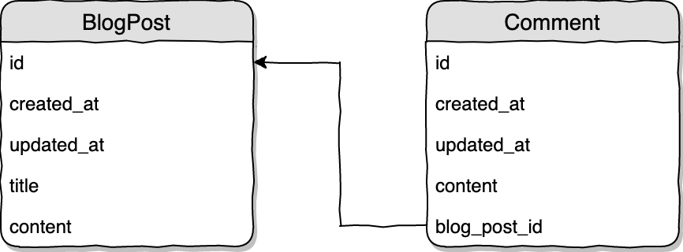

# Relationship 
- [One To One](#one-to-one)
- [One To Many](#one-to-many)
- [Many To Many](#many-to-many)
- Has One Of Many
- Has One Through
- Has Many Through
- One To One (Polymorphic)
- One To Many (Polymorphic)
- Many To Many (Polymorphic)
- 
## One to One

## Database design


In the example above each `Author` model has one `Profile`. 

[link](#accessing-related-object)

## Defining relations
Create Model with Migration
`php artisan make:model Author -m`
`php artisan make:model Profile -m`

The relation on `Author` model:
```php
class Author extends Model
{
    public function profile()
    {
        return $this->hasOne('App\Profile');
    }
}
```
Relation on `Profile` model:

```php
class Profile extends Model
{
    public function author()
    {
        return $this->belongsTo('App\Author');
    }
}
```

## Migrations

`Author` model migration:
```php
Schema::create('authors', function (Blueprint $table) {
    $table->bigIncrements('id');
    $table->timestamps();
});
```

`Profile` model migration:
```php
Schema::create('profiles', function (Blueprint $table) {
    $table->bigIncrements('id');
    $table->timestamps();

    $table->unsignedBigInteger('author_id');
    $table->foreign('author_id')->references('id')->on('authors');
});
```        
#### Note
In Phone Table, if we make column according to model name the id `(ex: user_id)`, our relationship will work without problem. But if different name `(ex:user_no_id)`, we must mention it as `foreign_key`.
```php
class User extends Model
{
    public function phone()
    {
        return $this->hasOne('App\Phone', ' user_no_id');
    }
}

class `Phone` extends Model
{
    public function user()
    {
        return $this->belongsTo('App\User','user_no_id');
    }
}
```
## How to work:
`Controller:` get all data by `User Model`
```php
$users = User::all();
return view('welcome', compact('users'));

// Welcome.blade.php:
@foreach($users as $user)
   <tr>
     <td>{{ $user->name }}</td>
     <td>{{ $user->phone->name }}</td>
   </tr>
@endforeach
```
`Controller`: get all data by `Phone Model`
```php 
$phones = Phone::all();
return view('welcome', compact('phones'));

// Welcome.blade.php:
@foreach($phones as $phone)
    <tr>
        <td>{{ $phone->user->name }}</td>
        <td>{{ $phone->name }}</td>
    </tr>
@endforeach
```

# Accessing related object 
```php
Accessing the relation on already loaded model
$author = Author::find(1);   // Load author model
$profile = $author->profile; // Load the relation (separate query is made)

$profile = Profile::find(1);
$author = $profile->author;

$author = Author::with('profile')->whereKey(1)->first(); //Loading the model with 1 relation at once
$author = Author::with(['profile', 'account'])->whereKey(1)->get(); //Loading the model with many relations at once
```

# One to Many 
- `Author and Post` Relationship: For each blog there is only `a single author` and a single author can have `many post`(one-to-many).
- `Category and Post` Relationship: One Category` can have `multiple posts`, but a `single post` must have `one category`(one-to-many)
- `Post and Comment` A `post` can have `many comments` but `a single` comment must have `one post` (one-to-many)
- `User and Comment` Relation: `A user` can have `many comments` but one comment must have `one User` (one-to-many)


`Comments` model migration:
```php
Schema::create('comments', function (Blueprint $table) {
    $table->bigIncrements('id');
    $table->text('content');
    // Foreign Key
    $table->unsignedBigInteger('blog_post_id')->index();
    $table->foreign('blog_post_id')->references('id')->on('blog_posts');
    $table->timestamps();
});
```
`Post` and `Comments` Model:
```php
class Post extends Model
{
    public function comments()
    {
        return $this->hasMany(Comment::class);
    }
}

class Comment extends Model
{
    public function post()
    {
        return $this->belongsTo(Post::class);
    }
}
```
```php
// Controller:
$posts = Post::with('comments')->get();
return view('welcome', compact('posts'));

// View
@foreach ($posts as $post)
    <tr>
        <td>{{ $post->title }}</td>
        <td>
         @foreach ($post->comments as $comment)
               <h6>{{ $comment->messege }}</h6>
         @endforeach
        </td>
    </tr>
@endforeach
```

# Many to Many
